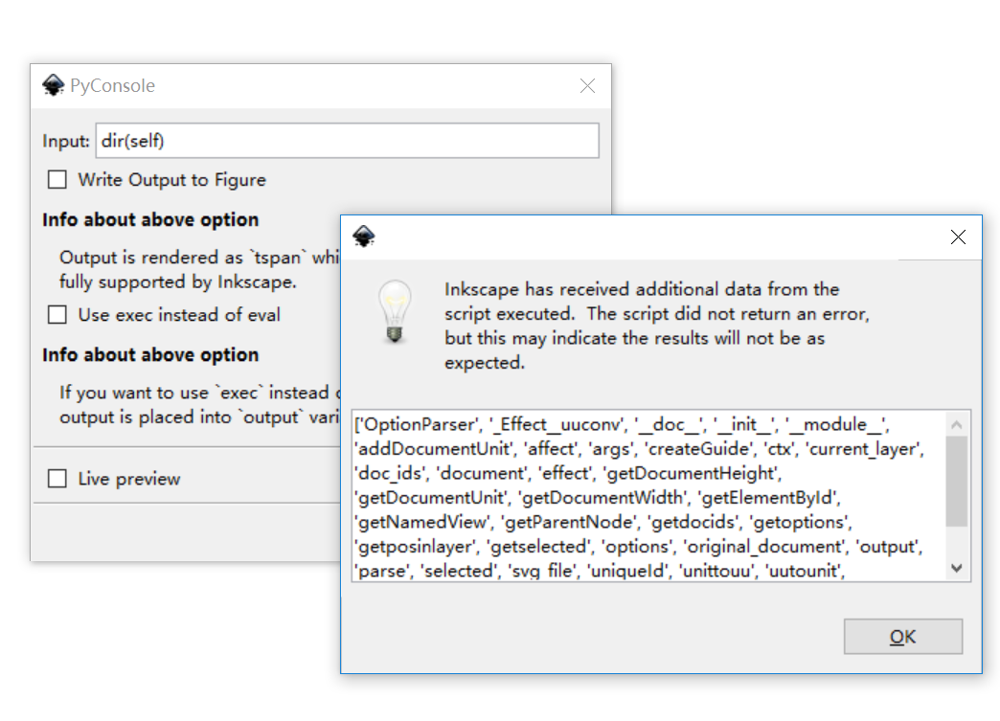
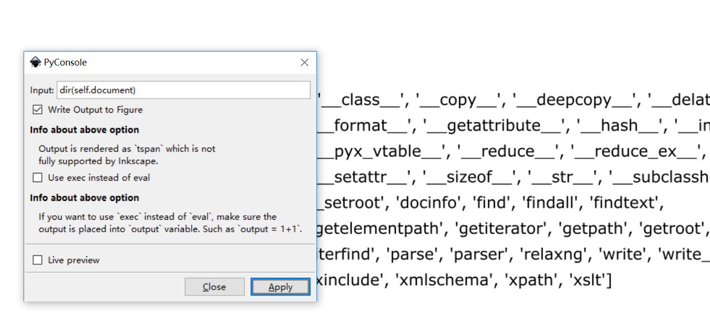
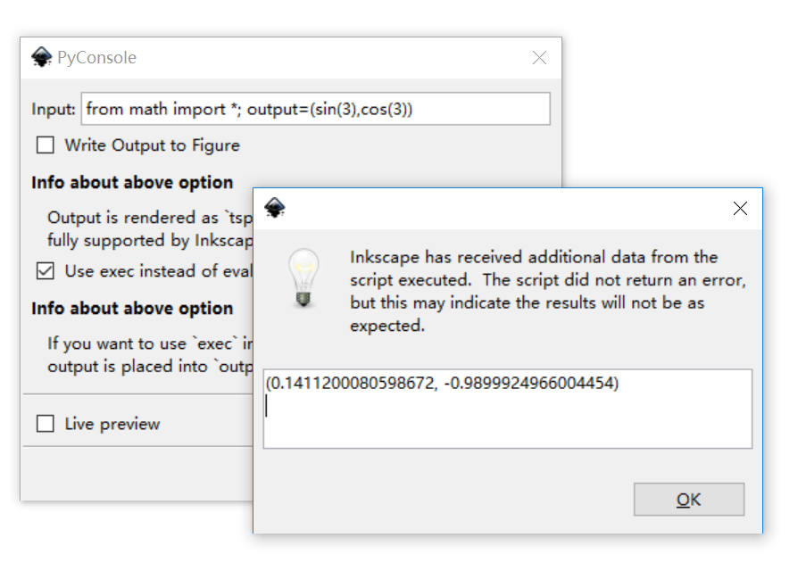
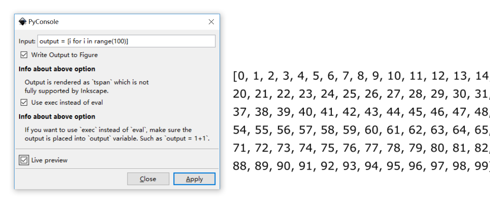

# PyConsole

This is a plugin for developers of Inkscape extension. Basically, the plugin let you run a snippet in the Python console of Inkscape.

Here are some possible usages:

1. Query for what is in the object:

2. Write the query results to svg file:

3. Do some simple calculation (Note: the `math` package is imported, this is why we have a option for using `exec` instead of `eval`)

4. You may also combine these two.

Basically, this is a simple plug-in with simple function. Hope you like it!

*This is a project extracted and extended from [WriteTeX](http://writetex.tk).*
